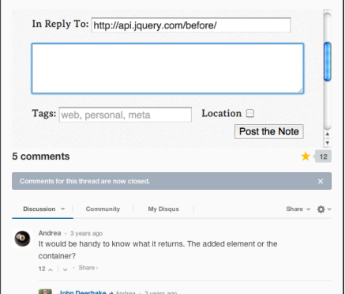
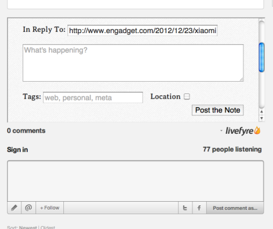

Own Your Comments
==============

Own Your Comments is a cross-browser extension which modifies pages you visit with comments boxes on, allowing you to post a backup of your comments to your own site, and allowing you to insert a link to your copy in the comment you leave.

Currently OYC performs the following manipulations:

* Inserting an iframe of your choice above Disqus and Livefyre comments services (as these are difficult to manipulate directly)

In the near future it will also:

* Hijack comments boxes on common wordpress themes
* Make the backup experience more seamless

## Why?

Because the comments you leave on webpages are owned either by the owner of the site, or by an external service like Disqus or Livefyre. They can modify or delete your comments at any time they want. By posting a copy to your own site, you retain tangible ownership over your words, and a record of them <del>if</del><ins>when</ins> the host site goes down.

## Installation

Own Your Comments is built with [kango](http://kangoextensions.com) and as such is cross-browser (apart from IE, unless you want to pay). The different versions are built in the repo, but until we offer signed, packaged downloads you’ll have to install them manually.

### Chrome

1. Clone the repo/download to your computer
1. In chrome, navigate to `chrome://chrome/extensions`
1. Enable developer mode (top right corner)
1. Click "Load Packaged Extension"
1. Navigate to the `/output/chrome/` folder within the cloned repo
1. Continue to [Setup](#setup)

### Safari

1. Clone the repo/download to your computer
1. Go Develop -> Show Extension Builder
1. Click the little plus sign in the bottom left, select "Add Extension"
1. Navigate to `/output/safari` and select the folder. Okay.
1. Click "Install" (top right)
1. There should be a new Own Your Comments button in your toolbar. Click this to set enter the options dialog, then continue

## Setup

You need to set the URL of the injected iframes to a URL of your choice. This URL should probably be a "new note/post/status" page on your website. It will be embedded into webpages which have Disqus or Livefyre comments boxes.

In the URL you can use <code>{url}</code> as a placeholder for the URL of the page you’re commenting on — this is really useful for auto-filling in-reply-to fields.

## Usage

Once everything’s set up, you should start seeing things like this happening:

